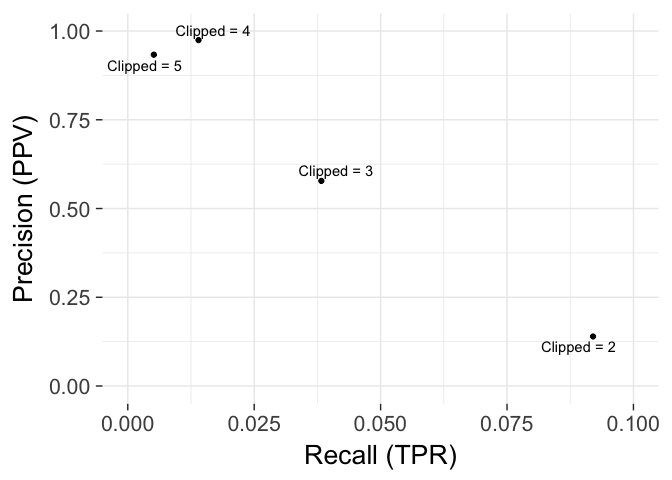

# Precision and recall

The number of breakpoints reported by ABySS-samtobreak for the original assembly is the total number of positives, $P = 2,717$, though some represent true structural variation and cannot be corrected. The number of breakpoints identified by Tigmint is the number of predicted positives, $PP = TP + FP$. The number of breakpoints remaining in the assembly after correction by Tigmint is the false negatives, $FN$. The reduction in the number of breakpoints identified by ABySS-samtobreak after the assembly is corrected by Tigmint is the number of true positives, $TP = P - FN$. The number of breakpoints identified by Tigmint minus the true positives is the number of false positives, $FP = PP - TP$. The precision is $PPV = TP / PP$, and the recall is $TPR = TP / P$. The G-score, or Fowlkes–Mallows index, is the geometric mean of precision and recall, $G = \sqrt{PPV \cdot TPR}$. The G-score is maximized when Clipped is 3.

{#fig:precision-recall}

Table: The effect on precision (PPV), recall (TPR), and G-score of varying the Depth and Clipped parameters of Tigmint. The number of breakpoints detected by ABySS-samtobreak in the uncorrected assembly is $P = 2,717$. The number of breakpoints identified by Tigmint is $PP$. The number of breakpoints remaining in the assembly after correction is $FN$. The reduction in the number of breakpoints is $TP = P - FN$. The number of false positives is $FP = PP - TP$. {#tbl:precision-recall}

| Depth | Clipped | PP   | FN   | TP  | FP   | PPV   | TPR   | G     |
| ----: | ------: | ---: | ---: | --: | ---: | ----: | ----: | ----: |
|   100 |       2 | 1792 | 2467 | 250 | 1542 | 0.140 | 0.092 | 0.113 |
|   100 |       3 |  180 | 2613 | 104 |   76 | 0.578 | 0.038 | 0.149 |
|   100 |       4 |   39 | 2679 |  38 |    1 | 0.974 | 0.014 | 0.117 |
|   100 |       5 |   15 | 2703 |  14 |    1 | 0.933 | 0.005 | 0.069 |

# Shortened URLs from the Main Text

Table: Shortened URLs {#tbl:urls}

| Short URL                           | Full URL
|-------------------------------------|-----------------------------------------
| <http://bit.ly/ncbi-giab-abyss2>    | <ftp://ftp-trace.ncbi.nlm.nih.gov/giab/ftp/data/AshkenazimTrio/analysis/BCGSC_HG004_ABySS2.0_assemblies_12082016/>
| <http://bit.ly/abyss2-ftp>          | <ftp://ftp.bcgsc.ca/supplementary/abyss2>
| <http://bit.ly/giab-hg004-chromium>  | <ftp://ftp-trace.ncbi.nlm.nih.gov/giab/ftp/data/AshkenazimTrio/HG004_NA24143_mother/10Xgenomics_ChromiumGenome/NA24143.fastqs/>
