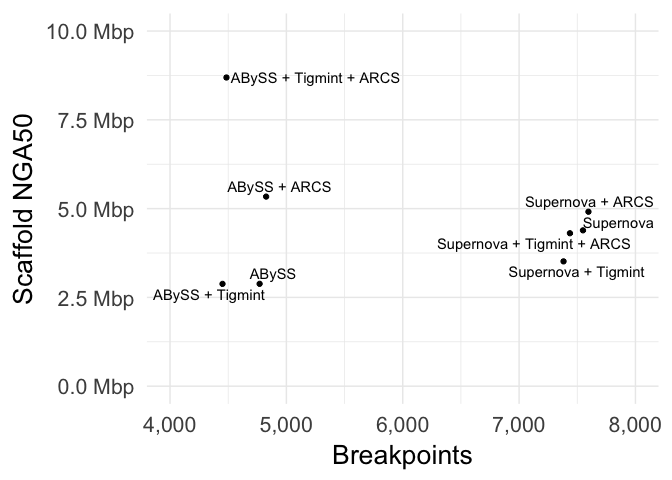
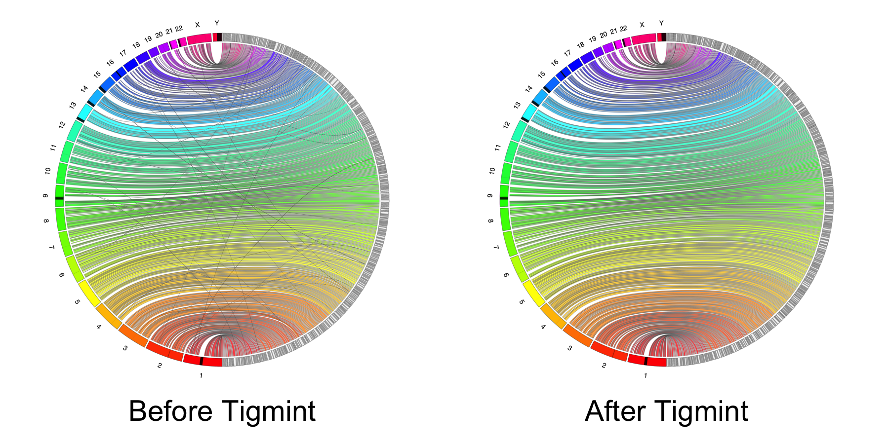
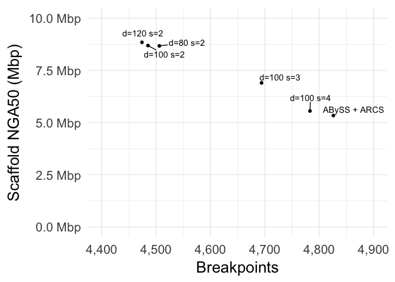

# Abstract

Long-read sequencing technologies have greatly improved assembly contiguity, but at a cost roughly ten times that of short-read sequencing technology. For population studies and when sequencing large genomes, such as conifer genomes and other economically important crop species, this cost may be prohibitive. The 10x Genomics Chromium technology generates linked reads from large DNA molecules at a cost comparable to standard short-read sequencing technologies. Whereas paired-end sequencing gives two reads from a small DNA fragment, linked reads yield roughly a hundred reads from molecules with a typical size of 10 to 100 kilobases. Linked reads indicate which reads were derived from the same DNA molecule, and so should be in close proximity in the underlying genome. Linked reads have been used previously to phase diploid genomes using a reference, *de novo* assemble complex genomes in the gigabase scale, and further scaffold draft assemblies.

In *de novo* sequencing projects, it is challenging yet important to measure the correctness of the resulting assemblies. Linked reads from technologies such as Chromium offer an opportunity to algorithmically address this problem. Here we introduce a software tool, Tigmint, to identify misassemblies using linked reads. The reads are first aligned to the assembly, and the extents of the large DNA molecules are inferred from the alignments of the reads. The physical coverage of the large molecules is more consistent and less prone to coverage dropouts than that of the short read sequencing data. Atypical drops in physical molecule coverage, less than the median minus 1.5 times the inter-quartile range (IQR), reveal possible misassemblies. Clipped alignments of the first and last reads of a molecule are used to refine the coordinates of the misassembly with base-pair accuracy.

No software tool currently exists for the specific purpose of identifying misassemblies using linked reads. The tool Long Ranger by 10x Genomics detects structural variants, which is a similar task. It requires however a reference genome assembled in fewer than 500 contigs, whereas a *de novo* assembly is often more fragmented. Tigmint addresses specifically the unaddressed problem of identifying misassemblies using linked reads.

Assemblies of short read sequencing data are easily confounded by repetitive sequence larger than the fragment size of the sequencing library. When the size of a repeat exceeds the library fragment size, the contig comes to an end in the best case, or results in misassembled sequence in the worst case. Tigmint is particularly useful in correcting these misassemblies when the initial assembly of the Illumina paired-end reads did not employ the barcodes of the linked reads, and this rich source of evidence is yet untapped.

Misassemblies not only complicate downstream analyses, but also limit the contiguity of the assembly, when incorrectly assembled sequences prevent joining their adjacent and correctly assembled sequences. To demonstrate the utility of Tigmint, we assemble the six megabase mitochondrial genome of Sitka spruce (*Picea sitchensis*) from 10x Genomics Chromium data using ABySS 2.0, identify and correct misassemblies using Tigmint, and scaffold using ARCS. Tigmint identifies 16 structural misassemblies in this case. After scaffolding with ARCS, the mitochondrial genome is assembled in 12 scaffolds larger than 100 kbp, with an N50 of 493 kbp. We plan to apply this method to assemble the twenty gigabase nuclear genome of Sitka spruce. Chromium reads permit cost-effective assembly of large genomes with high-throughput, short-read sequencing technology, while also providing large-molecule scaffolding data.

The source code of Tigmint is available for download from <https://github.com/bcgsc/tigmint> and is distributed under the GNU GPL v3.0 license.

# Introduction

Genome sequencing reads many short snippets of a genome. Genome assembly attempts to reconstruct the original genome form which these reads were derived. This task is difficult due to gaps and errors in the sequencing data, repetitive sequence in the underlying genome, and heterozygosity, and misassemblies are common. A number of tools exist to correct misassemblies. Pilon [@Walker_2014] maps reads to the assembly and calls variants to corrects small-scale misassemblies. NxRepair [@Murphy_2015] uses Illumina mate-pair sequencing to correct large-scale structural misassemblies.

The linked reads of 10x Genomics Chromium is an Illumina sequencing library prepared from high molecular weight DNA. Short reads derived from the same large molecule are tagged with same 16 nucleotide barcode sequence [@Weisenfeld_2017]. These linked reads have a number of applications. The LongRanger tool of 10x Genomics uses linked reads to map reads to repetitive sequence, phase small variants, and identify structural variants (<https://www.10xgenomics.com/software/>). GROC-SVs [@Spies_2017], NAIBR [@Elyanow_2017], and Topsorter (<https://github.com/hanfang/Topsorter>) identify structural variants using linked reads. ARCS [Yeo_2017], Architect [@Kuleshov_2016], and fragScaff [@Adey_2014] scaffold genome assemblies using linked reads. Supernova [@Weisenfeld_2017] assembles diploid genome sequences using 10x Genomics Chromium data. No tool yet exists for to identify and correct misassemblies using linked reads. We have developed the tool Tigmint for this purpose.

# Methods

## Algorithm

The user provides a draft assembly in FASTA format and the reads in FASTQ format. Tigmint first maps the reads to the reference using BWA-MEM [@Li_2013]. Aligning the reads can alternatively be performed using LongRanger rather than BWA-MEM. The alignments are filtered by mapping quality, alignment score, and number of mismatches to remove poorly aligned reads with the default thresholds $\textrm{MAPQ} > 0$, $\textrm{AS} \geq 100$, and $\textrm{NM} < 5$. Reads with the same barcode that map within 50,000 bp of the adjacent read are grouped into a molecule and assigned a unique numeric molecule identifier. A BED file is constructed, where each record indicates the start and end of one molecule, and records the number of reads that compose that molecule, their median mapping quality, alignment score, and number of mismatches. Molecules shorter than 2000 bp or a user-specified value are removed.

Regions with poor physical molecule coverage indicate potential misassemblies. The depth of molecule coverage at each position is computed from the molecule BED file using Bedtools [@Quinlan_2010]. The median and inter-quartile range (IQR) of the molecule depth of coverage is computed to determine the range of typical physical coverage for the experiment. Regions with coverage less than a threshold specified by the user, and suggested to be the median molecule coverage minus two times the IQR, are flagged as potential misassemblies.

The alignment to the assembly of the initial (left-most) read of a molecule that spans a misassembly will be clipped, and so the inferred genomic range of that molecule will start at precisely the position of the breakpoint. These clipped molecules are used to refine the breakpoint coordinates to base-pair resolution. Two molecules starting at the same position are required by default to identify a breakpoint, though this threshold parameter may be changed by the user.

The locations of these breakpoints are written to a tab-separated-values (TSV) file along with a summary of the evidence supporting the breakpoint, the number of molecules spanning that position (depth), and the number of molecules starting at that position (starts). The sequences of the original draft assembly are split at these breakpoints, producing a FASTA file.

Tigmint will optionally run ARCS [@Yeo_2017] and LINKS [@Warren_2015] at this point to scaffold these corrected sequences into an assembly that is hoped to be more contiguous and correct than the original draft. Tigmint will optionally align the scaffolds to a reference genome, if one is provided, to compute contiguity (NGA50) and correctness (number of breakpoints) metrics of the assembly using ABySS-samtobreak, included with ABySS [@Jackman_2017], before Tigmint, after Tigmint, and after ARCS and LINKS. Each breakpoint identified by ABySS-samtobreak indicates a difference between the assembly and the reference. These breakpoints are composed of both misassemblies and real structural variation between the reference genome and the individual who was sequenced.

## Human data set

We downloaded the ABySS 2.0 [@Jackman_2017] assembly `abyss-2.0/scaffolds.fa` from <http://bit.ly/ncbi-giab-abyss2> of the Genome in a Bottle (GIAB) HG004 Illumina paired-end and mate-pair reads [@Zook_2016]. We downloaded the 10x Genomics Chromium reads for this same individual from <http://bit.ly/giab-hg004-chromium> and used the LongRanger Basic pipeline to extract the barcodes from these reads. We ran Tigmint to correct the ABySS 2.0 assembly of HG004 using these Chromium reads with the command line `tigmint-make depth_threshold=100 starts_threshold=2 draft=abyss2 reads=hg004 ref=GRCh38 G=3088269832`. The threshold parameters are discussed in the results. The reference genome GRCh38 is used only to calculate assembly contiguity and correctness metrics. The script to run this analysis is available online at <https://github.com/sjackman/tigmint-data>.

# Results

Correcting the assembly with Tigmint reduces the number of breakpoints identified by ABySS-samtobreak by 250. While the scaffold NG50 decreased slightly, the scaffold NGA50 was unchanged. Correcting the assembly with Tigmint improves the correctness of the assembly without reducing its contiguity (NGA50). Scaffolding the uncorrected assembly with ARCS yields nearly a two-fold increase in NGA50, whereas correcting the assembly with Tigmint prior to scaffolding yields a three-fold increase in contiguity. Correcting the assembly and then scaffolding yields a final assembly that is both more correct and more contiguous than scaffolding without first using Tigmint, shown in @fig:metrics and @tbl:metrics.

{#fig:metrics}

Table: The assembly contiguity (scaffold NG50 and NGA50) and correctness (number of breakpoints) metrics with and without correction using Tigmint prior to scaffolding with ARCS. The reduction in the number of breakpoints from the row above it is shown in the final column. {#tbl:metrics}

| Assembly               | NG50 (Mbp) | NGA50 (Mbp) | Breakpoints | Reduction |
| ---------------------- | ---------: | ----------: | ----------: | --------: |
| ABySS                  |       3.49 |        2.97 |       2,717 |        NA |
| ABySS + Tigmint        |       3.30 |        2.97 |       2,467 |       250 |
| ABySS + ARCS           |       7.57 |        5.38 |       2,753 |        NA |
| ABySS + Tigmint + ARCS |      11.54 |        8.98 |       2,493 |       260 |

The alignments of the ABySS assembly to the reference genome before and after Tigmint are visualized using Circos [@Krzywinski_2009] in @fig:jupiter, which we call Jupiter plots. The reference chromosomes are shown on the left in colour, and the assembly scaffolds are shown on the right in gray. The scaffold segments on the right are arranged according the position of their best alignment to the reference. Chimeric scaffolds result in split alignments that manifest as lines criss-crossing the large coloured bands of concordant alignments. Small-scale structural variation is not visible due to the scale, but translocations (likely misassemblies) are readily visible. A number of these split alignments are visible in the assembly before Tigmint, whereas after Tigmint no such split alignments are visible.

{#fig:jupiter}

The median molecule depth of this data is 163, and its inter-quartile range (IQR) is 31. We set the depth threshold parameter of Tigmint to 100, the median depth minus two times the IQR. The effect of varying the depth and starts threshold parameters of Tigmint on the assembly contiguity and correctness metrics is shown in @fig:parameters and @tbl:parameters. The assembly metrics are relatively insensitive to varying the depth threshold parameter. The starts threshold parameter specifies the number of molecules starting at the same position required to break the scaffold at that position. Multiple molecules starting at the same position is required to determine the position of the breakpoint. We tested requiring 2, 3, and 4 coincident molecules, and we observed the best performance requiring only two coincident molecules to break a scaffold.

{#fig:parameters}

Table: The effect of varying the depth and starts threshold parameters of Tigmint on the scaffold NG50 and NGA50 and number of breakpoints. The reduction in the number of breakpoints from the original is shown in the final column. The original assembly is ABySS + ARCS without Tigmint. {#tbl:parameters}

|    Depth |   Starts | NG50 (Mbp) | NGA50 (Mbp) | Breakpoints | Reduction |
| -------: | -------: | ---------: | ----------: | ----------: | --------: |
| Original | Original |       7.57 |        5.38 |       2,753 |        NA |
|      100 |        4 |       7.87 |        5.59 |       2,701 |        52 |
|      100 |        3 |        9.4 |        6.94 |       2,632 |       121 |
|       80 |        2 |      11.25 |        8.93 |       2,504 |       249 |
|      100 |        2 |      11.54 |        8.98 |       2,493 |       260 |
|      120 |        2 |      11.25 |        9.09 |       2,491 |       262 |

# Discussion

Breakpoints are composed of both misassemblies and true differences, due to structural variation, between the sequenced individual and the reference genome. The median number of mobile-element insertions for example, just one class of structural variants, is estimated to be 1,218 per individual [@Sudmant_2015]. 
Breakpoints due to misassemblies can be corrected by inspecting the alignments of the reads to the assembly, whereas breakpoints due to true structural variation will not be corrected. For this reason, even a perfectly corrected assembly is expected to have many differences compared to the reference and so many breakpoints.

Tigmint uses linked reads to reduce the number of misassemblies in a genome sequence assembly. Scaffolding an assembly that has been so corrected yields an assembly that is both more contiguous and correct than an assembly that has not been corrected.

# References
