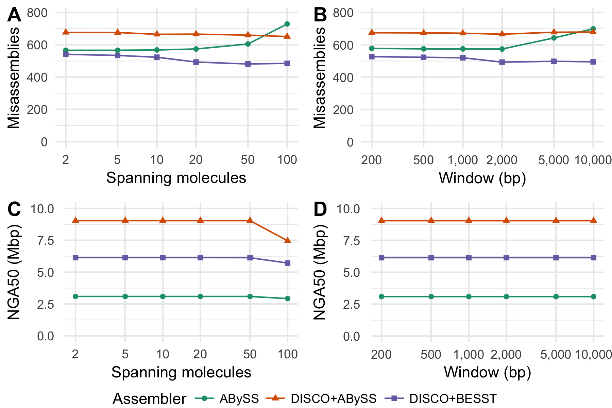

# Abstract

Genome sequencing yields the sequence of many short snippets of DNA from a genome. Genome assembly attempts to reconstruct the original genome form which these reads were derived. This task is difficult due to gaps and errors in the sequencing data, repetitive sequence in the underlying genome, and heterozygosity, and assembly errors are common. These misassemblies may be identified by comparing the sequencing data to the assembly and looking for discrepancies between the two. Once identified, these misassemblies may be corrected, improving the quality of the assembly.

The linked reads of 10x Genomics Chromium prepares an Illumina sequencing library from high molecular weight DNA, such that short reads derived from the same large molecule of DNA are tagged with the same 16 nucleotide barcode sequence. Although tools exist to identify and correct misassemblies using Illumina pair-end and mate-pair sequencing, no such tool yet exists that makes use of the long distance information of the large molecules provided by linked reads. We have developed the tool Tigmint for this purpose.

To demonstrate the effectiveness of Tigmint, we corrected an assembly of the human genome using ABySS 2.0 with Tigmint and scaffold using ARCS. Tigmint reduced the number of breakpoints in the ABySS assembly by 250. Whereas ARCS alone nearly doubled the NGA50 of the assembly, the combination of Tigmint + ARCS tripled the scaffold NGA50 of the assembly to nearly 9 Mbp, a notable improvement in contiguity. Chromium reads permit cost-effective assembly of large genomes with high-throughput, short-read sequencing technology, while also providing large-molecule scaffolding data.

The source code of Tigmint is available for download from <https://github.com/bcgsc/tigmint> and is distributed under the GNU GPL v3.0 license.

# Introduction

Assemblies of short read sequencing data are easily confounded by repetitive sequence larger than the fragment size of the sequencing library. When the size of a repeat exceeds the library fragment size, the contig comes to an end in the best case, or results in misassembled sequence in the worst case. Misassemblies not only complicate downstream analyses, but also limit the contiguity of the assembly, when incorrectly assembled sequences prevent joining their adjacent and correctly assembled sequences.

Long-read sequencing technologies have greatly improved assembly contiguity, by their ability to span these repeats, but at a cost roughly ten times that of short-read sequencing technology. For population studies and when sequencing large genomes, such as conifer genomes and other economically important crop species, this cost may be prohibitive. The 10x Genomics Chromium technology generates linked reads from large DNA molecules at a cost comparable to standard short-read sequencing technologies. Whereas paired-end sequencing gives two reads from a small DNA fragment, linked reads yield roughly a hundred reads from molecules with a typical size of 10 to 100 kilobases. Linked reads indicate which reads were derived from the same DNA molecule, and so should be in close proximity in the underlying genome. Linked reads have been used previously to phase diploid genomes using a reference [@Zheng_2016], *de novo* assemble complex genomes in the gigabase scale [@Weisenfeld_2017], and further scaffold draft assemblies [@Mostovoy_2016].

A number of software tools employ linked reads for various applications. The LongRanger tool of 10x Genomics uses linked reads to map reads to repetitive sequence, phase small variants, and identify structural variants (<https://www.10xgenomics.com/software/>). GROC-SVs [@Spies_2017], NAIBR [@Elyanow_2017], and Topsorter (<https://github.com/hanfang/Topsorter>) identify structural variants using linked reads. ARCS [@Yeo_2017], Architect [@Kuleshov_2016], and fragScaff [@Adey_2014] scaffold genome assemblies using linked reads. Supernova [@Weisenfeld_2017] assembles diploid genome sequences using 10x Genomics Chromium data. No tool yet exists to identify and correct misassemblies using linked reads.

In *de novo* sequencing projects, it is challenging yet important to ensure the correctness of the resulting assemblies. Tools to correct misassemblies typically inspect the reads aligned back to the assembly to identify discrepancies. Pilon [@Walker_2014] inspects the alignments to identify variants and correct small-scale misassemblies. NxRepair [@Murphy_2015] uses Illumina mate-pair sequencing to correct large-scale structural misassemblies. Linked reads offer an opportunity to use the long-range information provided by large molecules to identify misassemblies, yet no software tool currently exists to correct misassemblies using linked reads. Here we introduce a software tool, Tigmint, to identify misassemblies using linked reads.

The reads are first aligned to the assembly, and the extents of the large DNA molecules are inferred from the alignments of the reads. The physical coverage of the large molecules is more consistent and less prone to coverage dropouts than that of the short read sequencing data. Atypical drops in physical molecule coverage reveal possible misassemblies. Coincident clipped alignments of the first read of a molecule are used to refine the coordinates of the misassembly with base-pair accuracy. Finally, the linked reads may be used to scaffold the corrected assembly with ARCS [@Yeo_2017] and LINKS [@Warren_2015].

# Methods

## Algorithm

The user provides a draft assembly in FASTA format and the reads in FASTQ format. Tigmint first maps the reads to the reference using BWA-MEM [@Li_2013]. The alignments are filtered by mapping quality, alignment score, and number of mismatches to remove poorly aligned reads with the default thresholds $\textrm{MAPQ} > 0$, $\textrm{AS} \geq 100$, and $\textrm{NM} < 5$. Reads with the same barcode that map within 50,000 bp of the adjacent read are grouped into a molecule and assigned a unique numeric molecule identifier. A BED file is constructed, where each record indicates the start and end of one molecule, and records the number of reads that compose that molecule, their median mapping quality, alignment score, and number of mismatches. Unusually small molecules, shorter than 2000 bp by default, are filtered out.

Regions with poor physical molecule coverage indicate potential misassemblies. The depth of molecule coverage at each position is computed from the molecule BED file using Bedtools [@Quinlan_2010]. The median and inter-quartile range (IQR) of the molecule depth of coverage is computed to determine the range of typical physical coverage for the experiment. Regions with coverage less than a threshold specified by the user, and suggested to be the median molecule coverage minus two times the IQR, are flagged as potential misassemblies.

The alignment to the assembly of the initial (left-most) read of a molecule that spans a misassembly will be clipped, and so the inferred genomic range of that molecule will start at precisely the position of the breakpoint. These clipped molecules are used to refine the breakpoint coordinates to base-pair resolution. Two molecules starting at the same position are required by default to identify a breakpoint, though this threshold parameter may be adjusted by the user.

The locations of these breakpoints are written to a tab-separated-values (TSV) file along with a summary of the evidence supporting the breakpoint, the number of molecules spanning that position (depth), and the number of molecules starting at that position (starts). The sequences of the original draft assembly are split at these breakpoints, producing a FASTA file.

Tigmint will optionally run ARCS [@Yeo_2017] and LINKS [@Warren_2015] at this point to scaffold these corrected sequences and improve the contiguity of the assembly. Tigmint will optionally align the scaffolds to a reference genome, if one is provided, to compute contiguity (NGA50) and correctness (number of breakpoints) of the assemblies before Tigmint, after Tigmint, and after ARCS and LINKS. The assembly metrics are calculated using ABySS-samtobreak, included with ABySS [@Jackman_2017]. Each breakpoint identified by ABySS-samtobreak indicates a difference between the assembly and the reference. These breakpoints are composed of both misassemblies and real structural variation between the reference genome and the individual who was sequenced.

## Human data set

We downloaded the ABySS 2.0 [@Jackman_2017] assembly `abyss-2.0/scaffolds.fa` from <http://bit.ly/ncbi-giab-abyss2> of the Genome in a Bottle (GIAB) HG004 Illumina paired-end and mate-pair reads [@Zook_2016]. We downloaded the 10x Genomics Chromium reads for this same individual from <http://bit.ly/giab-hg004-chromium> and used the LongRanger Basic pipeline to extract the barcodes from these reads. We ran Tigmint to correct the ABySS 2.0 assembly of HG004 using these Chromium reads with the parameters `depth_threshold=100 starts_threshold=2`. The choice of threshold parameters is discussed in the results. Both the uncorrected and corrected assembly are scaffolded using ARCS and LINKS. These assemblies are aligned to the GRCh38 reference genome using `bwa mem -xintractg`. The scaffold NGA50 and number of breakpoints are calculated using `abyss-samtobreak -G3088269832 -q10 -l500`. The script to run this analysis is available online at <https://github.com/sjackman/tigmint-data>.

# Results

Correcting the assembly of the human data set HG004 with Tigmint reduces the number of breakpoints identified by ABySS-samtobreak by 250. While the scaffold NG50 decreased slightly, the scaffold NGA50 was unchanged. Correcting the assembly with Tigmint improves the correctness of the assembly without reducing its contiguity (NGA50). Scaffolding the uncorrected assembly with ARCS yields nearly a two-fold increase in NGA50, whereas correcting the assembly with Tigmint prior to scaffolding yields a three-fold increase in contiguity. Correcting the assembly and then scaffolding yields a final assembly that is both more correct and more contiguous than scaffolding without first using Tigmint, shown in @fig:metrics and @tbl:metrics.

{#fig:metrics}

Table: The assembly contiguity (scaffold NG50 and NGA50) and correctness (number of breakpoints) metrics with and without correction using Tigmint prior to scaffolding with ARCS. The reduction in the number of breakpoints from the row above it is shown in the final column. {#tbl:metrics}

| Assembly         | NG50 (Mbp) | NGA50 (Mbp) | Breakpoints | Reduction |
| ---------------- | ---------: | ----------: | ----------: | --------: |
| ABySS            |       3.49 |        2.97 |       2,717 |        NA |
| + Tigmint        |       3.30 |        2.97 |       2,467 |       250 |
| + ARCS           |       7.57 |        5.38 |       2,753 |        NA |
| + Tigmint + ARCS |      11.54 |        8.98 |       2,493 |       260 |

The alignments of the ABySS assembly to the reference genome before and after Tigmint are visualized using Circos [@Krzywinski_2009] in @fig:jupiter, which we call Jupiter plots (<https://github.com/JustinChu/JupiterPlot>). The reference chromosomes are shown on the left in colour, and the assembly scaffolds are shown on the right in gray. The scaffolds on the right are arranged according the position of their best alignment to the reference. Chimeric scaffolds result in split alignments that manifest as lines criss-crossing the large coloured bands of concordant alignments. Small-scale structural variation is not visible due to the scale, but translocations (likely misassemblies) are readily visible. A number of these split alignments are visible in the assembly before Tigmint, whereas after Tigmint no such split alignments are visible.

{#fig:jupiter}

The median molecule depth of this data is 163, and its inter-quartile range (IQR) is 31. We set the depth threshold parameter of Tigmint to 100, the median depth minus two times the IQR. The effect of varying the depth and starts threshold parameters of Tigmint on the assembly contiguity and correctness metrics is shown in @fig:parameters and @tbl:parameters. The assembly metrics are relatively insensitive to varying the depth threshold parameter. The starts threshold parameter specifies the number of molecules starting at the same position required to break the scaffold at that position. Multiple molecules starting at the same position is required to determine the position of the breakpoint. We tested thresholds of 2, 3, and 4 coincident molecules, and we observed the best performance when requiring two coincident molecules to break a scaffold.

{#fig:parameters}

Table: The effect of varying the depth and starts threshold parameters of Tigmint on the scaffold NG50 and NGA50 and number of breakpoints. The first row is the original assembly, ABySS + ARCS without Tigmint. The reduction in the number of breakpoints from the original assembly is shown in the final column. {#tbl:parameters}

| Depth | Starts | NG50 (Mbp) | NGA50 (Mbp) | Breakpoints | Reduction |
| ----: | -----: | ---------: | ----------: | ----------: | --------: |
|    NA |     NA |       7.57 |        5.38 |       2,753 |        NA |
|   100 |      4 |       7.87 |        5.59 |       2,701 |        52 |
|   100 |      3 |        9.4 |        6.94 |       2,632 |       121 |
|    80 |      2 |      11.25 |        8.93 |       2,504 |       249 |
|   100 |      2 |      11.54 |        8.98 |       2,493 |       260 |
|   120 |      2 |      11.25 |        9.09 |       2,491 |       262 |

# Discussion

When aligning an assembly of an individual's genome to a reference genome of its species, we expect to see breakpoints where the assembled genome differs from the reference genome. These breakpoints are caused by both misassemblies and true differences between the individual and the reference. The median number of mobile-element insertions for example, just one class of structural variant, is estimated to be 1,218 per individual [@Sudmant_2015]. Misassemblies can be corrected by inspecting the alignments of the reads to the assembly. Correcting these misassemblies reduces the number of breakpoints when compared to the reference. Breakpoints due to true structural variation will however remain. For this reason, even a perfectly corrected assembly is expected to have a number of differences when compared to the reference.

Tigmint uses linked reads to reduce the number of misassemblies in a genome sequence assembly. The contiguity of the assembly is not appreciably affected by such a correction, while yielding an assembly that is more correct. Most scaffolding tools order and orient the sequences that they are given, but do not attempt to correct misassemblies. These misassemblies hold back the contiguity that can be achieved by scaffolding. Two sequences that should be connected together cannot be when one of those two sequences is connected incorrectly to a third sequence. By first correcting these misassemblies, the scaffolding tool can do a better job of connecting sequences, and we observe precisely this harmonious effect. Scaffolding an assembly that has been corrected with Tigmint yields a final assembly that is both more correct and substantially more contiguous than an assembly that has not been corrected.

# References
